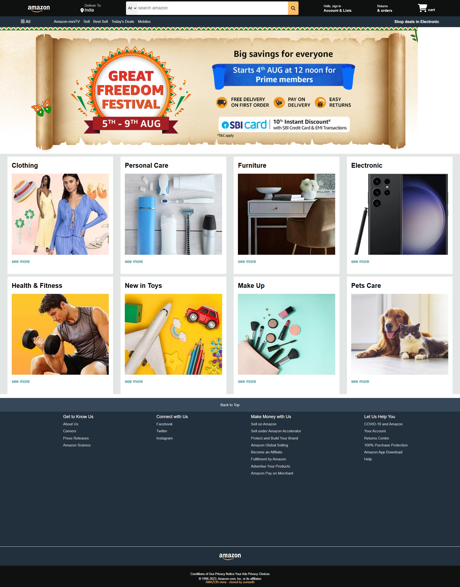

# General E-Commerce UI 🛒

> **First Milestone:** This project represents my initial steps into web development. It is a pixel-perfect HTML/CSS recreation of a standard e-commerce shopping interface.

## 🖼️ Project Preview

*(A snapshot of the static UI implementation)*

## 🛠️ Tech Stack
* **HTML5**
* **CSS3** (Flexbox & Grid)
* **No Frameworks** (Pure Code)

## 🚀 How to View
[**🔗 View Live Site**](https://sumanthkatta-dev.github.io/amazon-clone-2023/)

> **⚠️ Seeing a Red "Dangerous Site" Warning?**
>
> Because this project painstakingly recreates the layout using original brand assets (logos/names) for educational realism, Google's automated security bots may flag it as "Phishing." **This is a false positive.**
>
> **How to bypass the warning:**
> 1. Click the **"Details"** button on the red screen.
> 2. Click **"Visit this unsafe site"** (text is often underlined).
>
> *This is a 100% static student portfolio project and is completely safe to view.*

---
*Developed by Sumanth Katta*
